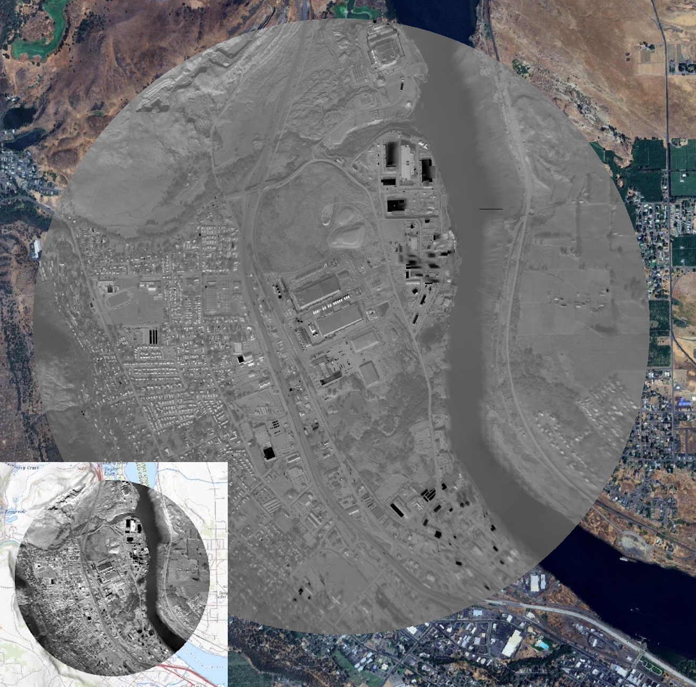

# Automosaic

This repository contains code to create othomosaics from geolocated thermal images like those generated by [Lab 308](https://lab-308.com)'s cameras. This repository mostly contains wrappers to run [ODM](https://github.com/NathanMOlson/ODM) on Google Cloud. ODM in turn runs [OpenSfM](https://github.com/NathanMOlson/OpenSfM) and [DEM2mosaic](https://github.com/NathanMOlson/dem2mosaic).



## Batcher

The Batcher application runs a server that receives images over HTTP. It then saves them to Google Cloud Storage in the `images` folder. It also collects images from an orbit and saves them to Google Cloud Storage in the `datasets` folder, and runs the Google Cloud Function `Mosaic`.

### Building

Batcher uses Docker and is compatible with Google Cloud Run, which allows it to "scale to "zero", meaning there is no billing when no images are being uploaded.

```docker build -f batcher/Dockerfile . -t batcher```

### Configuration

Batcher is configured using the following environment varaibles:

`STORAGE_BUCKET`: Google Storage bucket for image and dataset 

`MOSAIC_JOB_NAME`: Name of the Google Cloud function to run on collected 

`KEEPALIVE_SECONDS`: How long to keep the server alive for when no images are being received (defaults to 60 if unspecified)

## Mosaic

The Mosaic application assembles a group of images (a "dataset") int a wide-area orthophoto.

### Building

Mosaic uses Docker and is compatible with Google Cloud Run Function. It is invoked on each collected dataset.

```docker build . -f mosaic/Dockerfile  -t mosaic```

### Configuration

Mosaic is configured using the following environment variables:

`BUCKET`: Google Storage bucket for input dataset and output GeoTIFF

`DATASET`: Path relative to `BUCKET` for input dataset. Should be a .tar file

### Running locally

To run locally, do not set the environment variable `BUCKET`. Place the dataset in the docker container at `/datasets/test.tar`. One way to do this is by using a remote mount: 

```docker run -it --entrypoint /bin/bash --rm -v ./datasets:/datasets mosaic```

The output will be saved in the Docker file at `/datasets/test.tiff`.

## Cloud Deployment

One proven way to deploy this functionality to the cloud is shown below.


## License

This software is provided by Lab 308 under the [AGPL version 3](https://www.gnu.org/licenses/agpl-3.0.html).

## Acknowledgements

This software uses [OpenDroneMap](https://github.com/OpenDroneMap/ODM) and [OpenSfM](https://github.com/mapillary/OpenSfM).